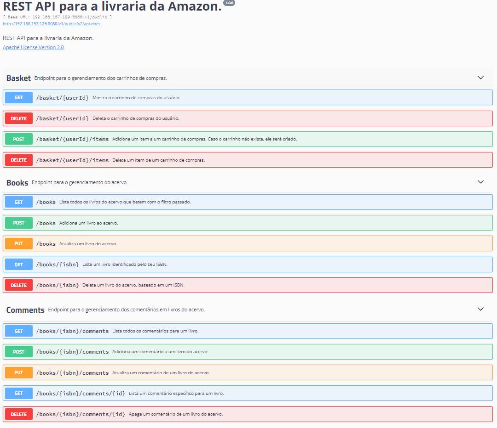

# amazon-library

API para gerenciamento do acervo de livros da livraria da Amazon.

## Desenho da API

Abaixo esta o desenho da API baseado na documentação gerada pelo Swagger2.

## 11 regras utilizadas para desenhar a API.

### APIs organizadas ao longo de recursos
As APIs foram organizadas com base nos recursos: books, basket e comments.

### APIs padronizadas
As APIs foram padronizadas, utilizando substantivos no plural para URIs que fazem referência à coleções e singular para as demais. Exemplo:
 - /v1/public/books
 - /v1/public/basket
 
### APIs projetadas para mapear entidades de negócio e suas operações
 - /v1/public/books/{isbn}/comments
 
### APIs simples
Os recursos que envolvem coleções foram limitados ao padrão de coleção/item/coleção:
 - /v1/public/books/{isbn}/comments
 
### Atualização em lote para operações complexas
Não implementado.

### Padrão ISO 8601 para os atributos de data/hora
Os recursos que possuem atributos de data/hora (criação de livros e comentários) utilizam o formato yyyy-MM-ddTHH:mm:ss.

### APIs documentadas
As APIs foram devidamente documentadas utilizando o Swagger2. Para consultar a documentação acesse http://[IP]:8080/v1/public/swagger-ui.html

### Utilizar o protocolo HTTPS/SSL
Em produção, o servidor de aplicações deverá ser configurado com um certificado válido para permitir acesso às APIs utilizando o protocolo HTTPS.

### APIs versionadas
A URI básica da API é baseada no versionamento da mesma: /v1/public/* 

### Utilizar paginação para coleções com grandes volumes
Coleções de livros e comentários são obtidos parcialmente através de páginas. Além dos resultados, a API retorna a página atual, quantidade total de itens, quantidade de itens que foram retornados e a quantidade de itens pulados.
 - /v1/public/books?isbn=SA8763&limit=10&offset=5
 - /v1/public/books/SA8763/comments?limit=10&offset=5

### Utilização os códigos HTTP
 - 200 (OK) Quando os recursos são encontrados com sucesso.
   - GET /v1/public/books
   - GET /v1/public/books/{isbn}
 - 201 (Created) A solicitação foi bem sucedida e um novo recurso foi criado.
   - POST /v1/public/books
 - 404 (Not Found) O arquivo requisitado não pode ser encontrado.
   - POST /v1/public/books/{isbn}
 - 405 (Method Not Allowed) O método especificado na requisição não é permitido.
   - DELETE /v1/public/books/{isbn}/comments/{id}
